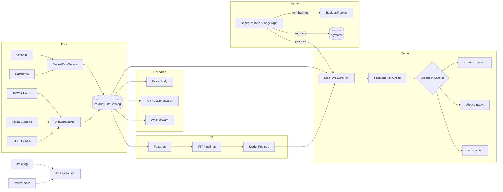

# Architecture

This document is the canonical structural reference. It is intentionally short on
opinion; opinions live in `docs/READING.md`.

## Design pillars

1. **One Strategy class, three runtimes.** A `BlackOrcaStrategy` subclass runs
   identically against the simulated venue (backtest), Alpaca paper, and Alpaca
   live. No code paths diverge. Every order goes through the same
   `submit_order()` shim, which hands it to `PreTradeRiskCheck` before the
   venue ever sees it.

2. **Point-in-time integrity is structural, not a convention.** Every data row
   carries two timestamps: `as_of` (when the world said it was true) and
   `observed_at` (when we received it). PIT joins use `observed_at`; ledger
   ordering uses `as_of`. The `pit.assert_no_lookahead()` validators run at
   ingest time and inside tests.

3. **Interfaces at the seams, simple internals.** Five abstract surfaces:
   `MarketDataSource`, `AltDataSource`, `Strategy`, `ExecutionAdapter`,
   `RiskCheck`. Inside each, prefer explicit code over factories.

## Component map

## Module-level contract summary

| Module                  | Contract                                                                  |
|-------------------------|---------------------------------------------------------------------------|
| `data.contracts`        | Pydantic schemas with mandatory `as_of` / `observed_at`                   |
| `data.sources.base`     | `MarketDataSource.fetch_bars(...) -> pl.DataFrame`                         |
| `data.catalog`          | `Catalog.write_bars`, `read_bars`, `list_instruments`                      |
| `data.pit`              | `assert_no_lookahead(df)` raises on any violation                          |
| `strategies.base`       | `BlackOrcaStrategy.on_bar(bar)`; sizing & order helpers                    |
| `risk.pretrade`         | `check(order, state) -> Decision`                                          |
| `backtest.runner`       | `run_backtest(strategy, ...) -> BacktestResult`                            |
| `agents.client`         | `AnthropicClient.complete(messages, schema?)`                              |
| `agents.tools`          | Pydantic-typed callables the agent invokes                                 |

## Storage backends

- **Catalog** — local Parquet directory by default (`data/catalog/`), or
  `s3://bucket/prefix/` for the eventual AWS lift-and-shift. Polars writes
  partitioned by `(symbol, year)`.
- **Agent memory** — `pgvector` table in the Docker Postgres. The
  `agents.memory.MemoryStore` interface has an in-memory fallback for tests and
  for running without Docker.
- **Reports** — HTML files in `data/reports/`, intended to be statically served.

## Runtime profiles

| Profile | Engine source | Broker        | Notes                              |
|---------|---------------|---------------|------------------------------------|
| `dev`   | sim           | none          | Hot reload, looser risk            |
| `paper` | live (sim ok) | Alpaca paper  | Full risk system active            |
| `live`  | live          | Alpaca live   | Strictest risk, kill switch armed  |

## Nautilus Trader integration plan

The system is designed to host Nautilus Trader as the execution engine. We
ship a working internal event-driven engine (`backtest/runner.py`) whose data
model (Bar / Trade / Quote, OrderFactory, Position, Account) mirrors Nautilus.
A `NautilusBacktestAdapter` is stubbed in `backtest/runner.py` and a
`NautilusTradingNode` shim in `live/trading_node.py` documents the migration
path. The day Nautilus stabilizes on Windows and adds a clean `databento`
integration, we lift in the adapter without touching any Strategy code.
